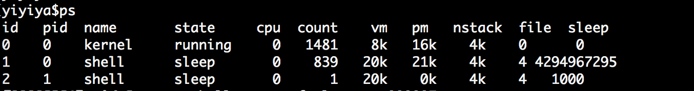

# 内核开发

在YiYiYa操作系统，使用的是鸭内核duck kernel。内核项目是单独的，所以在开发中可以仅仅更新内核，而不需要修改其他地方的源码，方便内核迭代升级。

鸭内核使用的是模块化的设计，和一般的os概念差别不是特别明显。

## 进程管理

在鸭内核，进程统一是特定主题的集合，名字叫thread。所有thread开头的函数都是进程相关的操作。

不管是内核进程和用户进程，两个概念是一致的，区别在于进程的运行内核等级不一样，内核进程权限高，而用户进程在用户空间中，没有特别的权限访问内核资源，保证了内核的可靠性，防止进行非法操作。

### 进程创建

理解进程中一个重要的结构是thread_t。thread_t包括了进程的名字和拥有的资源和权限等。

```c
typedef struct thread {
  u32 id;//进程id
  u8* name;//进程名称
  int priority;//进程优先级
  int counter;//进程运行tick数
  int state;//进程状态
  int sleep_counter;
  struct thread_s* next;//下一个进程
  void* data;//私有数据
  void* exec;//运行参数
  context_t context;//进程上下文
  vmemory_area_t* vmm;//进程虚拟内存范围
  u32 pid;//父进程
  u32** fds;//拥有的文件
  u32 fd_size;//文件最大数量
  u32 fd_number;//文件数量
  u32 lock;
  u32 code;//错误码
  u32 fault_count;
  vfs_t* vfs;//当前文件路径
  u32 level;//进程等级
  u32 cpu_id;//所在哪个cpu上运行
  u32 mem;//进程内存使用量
} thread_t;
```

使用thread_create_name_level创建带权限等级的进程，KERNEL_MODE表示是内核进程。内核进程为kernel id为0。在shell中使用ps命令可以看到。shell进程是普通的用户进程，运行在用户空间，有单独的堆栈和页目录。

thread_create_name经常用来创建用户进程。创建后需要调用thread_run，让这个进程运行。

```c
int kmain(int argc, char* argv[]) {
  kernel_init();

  thread_t* t1 = thread_create_name_level("kernel", (u32*)&do_kernel_thread,
                                          NULL, KERNEL_MODE);
  thread_t* t2 = thread_create_name("shell", (u32*)&do_shell_thread, NULL);
  thread_run(t1);
  thread_run(t2);
  ...
  return 0;
}
```

id为0的是内核进程，做内核初始化和模块加载等功能。id为1的是用户进程，是shell进程，用户和YiYiYa操作系统交互的主要途径。



### 进程停止

进程可以通过thread_stop和thread_exit进行停止运行或者退出运行。thread_stop会修改进程状态为stop。thread_exit会修改返回code错误码。

如下所示，为一个系统调用退出，供c语言中的exit(0)，功能等效。

```c

void sys_exit(int status) {
  thread_t* current = thread_current();
  thread_exit(current, status);
  // thread_dumps();
  log_debug("sys exit tid %d %s status %d\n", current->id, current->name,
            status);
}
```


## 文件系统

在鸭内核中，文件系统使用的是Virtual File System，简称VFS，为什么要使用VFS，主要是可以实现多种文件系统的支持和扩展。

在文件系统中，最小的单位是vnode_t，它定义了一个最基本的文件，这个文件可以是设备，也可以是文件，或者其他的虚拟等等。所有的操作，都通过vnode进行。

```c
typedef struct vnode {
  char *name;  // The filename.
  u32 mask;    // The permissions mask.
  u32 uid;     // The owning user.
  u32 gid;     // The owning group.
  u32 flags;   // Includes the node type. See #defines above.
  u32 inode;   // This is device-specific - provides a way for a filesystem to
               // identify files.
  u32 length;  // Size of the file, in bytes.
  u32 impl;    // An implementation-defined number.
  vnode_t *parent;  // Used by mountpoints and symlinks.
  vnode_t **child;
  vnode_t *super;
  size_t child_number;
  size_t child_size;
  void *data;
  void *device;
  voperator_t *op;//文件操作辅助功能
} vnode_t;
```


### 文件的创建

创建一个时间设备文件，通过先创建文件节点vfs_create_node，后定义op操作，然后就完成了文件创建。

```c
// time
device_t* rtc_dev = device_find(DEVICE_RTC);
if (rtc_dev != NULL) {
    vnode_t* time = vfs_create_node("time", V_FILE);
    vfs_mount(NULL, "/dev", time);
    time->device = rtc_dev;
    time->op = &device_operator;
} else {
    kprintf("dev time not found\n");
}

```

### 文件挂载操作

在鸭内核中，挂载通过vfs_mount来实现，挂载到特定目录。创建时间设备后，通过vfs_mount传入，挂载的文件地址，就可以挂载时间为一个文件，最后路径是/dev/time，在应用层，就可以对它进行读写操作。

```c
vfs_mount(NULL, "/dev", time);
```


## 内存管理

鸭内核使用的内存管理，比较简单，一个最基本的物理内存管理，和基于内存池的页式内存管理。

在内核中使用通过kmalloc函数进行内存申请，kfree进行内存释放。缺页的管理是内核自动托管，不需要手工处理。

鸭内核可以扩展物理内存管理，目前有2套物理内存管理方法。

### 物理内存使用

通过定义arch/memory.c文件中的memory_manager_t结构，可以自定义物理内存管理。

```c
void mm_init() {
  kprintf("mm init\n");
  mmt.init = ya_alloc_init;//设置内存分配初始化函数
  mmt.alloc = ya_alloc;//设置内存分配函数
  mmt.free = ya_free;//设置内存释放函数
  mmt.blocks = NULL;
  mmt.blocks_tail = NULL;
  mmt.g_block_list = NULL;
  mmt.g_block_list_last = NULL;
  mmt.alloc_count = 0;
  mmt.alloc_size = 0;
  mmt.last_map_addr = 0;
  mmt.extend_phy_count = 0;
  ...
}


void* mm_alloc(size_t size) { 
    return mmt.alloc(size);
}

void mm_free(void* p) { 
    return mmt.free(p); 
}

```

### 虚拟内存使用

鸭内核中，虚拟内存使用，通过kmalloc进行的，kmalloc根据标志，分配物理内存还是虚拟内存。

物理内存时候，调用phy_alloc，虚拟内存时候调用vm_alloc。用法比较简单。

```c
void* kmalloc(size_t size, u32 flag) {
  void* addr = NULL;
  if (flag & KERNEL_TYPE || flag & DEVICE_TYPE) {
    addr = phy_alloc(size);
  } else {
    addr = vm_alloc(size);
  }
  return addr;
}
```

另外缺页内存分配，使用的是valloc，当应用程序访问某个地址的时候，内核发现地址不存在，就会进行页分配。最后会调用valloc 尝试分配一个物理内存，同时映射到虚拟内存地址。

```c

void *phy = virtual_to_physic(current->context.upage, fault_addr);
if (phy == NULL) {
    valloc(fault_addr, PAGE_SIZE);
} else {
    log_error("%s phy: %x remap memory fault at %x\n", current->name, phy,
            fault_addr);
    context_dump_fault(context, fault_addr);
    thread_exit(current, -1);
    cpu_halt();
}

```


## 模块管理

由于YiYiYa使用模块化的的实现，所以大部分要做的事情是定义模块。基本的过程是定义模块，然后注册模块。

在新增内核功能，特别是驱动，都是通过模块的管理，方便内核的功能裁剪，可以动态编译添加所需模块。

### 定义模块

引入内核头kernel.h，定义一个hello_module模块，为moudle_t的类型。

```c
#include "kernel/kernel.h"

int hello_init(void) {
  kprintf("Hello World\n");
  //驱动设备初始化
  serial_init();
  ...
  return 0;
}

void hello_exit(void) { kprintf("hello exit\n"); }

module_t hello_module = {
    .name ="hello",
    .init=hello_init,
    .exit=hello_exit
};
```

### 注册模块

在内核中需要在内核启动的线程中注册，这样YiYiYa操作系统就会识别到模块，然后在内核线程启动的时候，完成了模块的加载，就可以运行在内核中了。

```c
//引入模块
extern module_t hello_module;

void modules_init(void) {
    ...
    //注册模块
    module_regist(&hello_module);
}

```
## 系统功能

在鸭内核中，用户态用到的功能都是在sysfn下，每次使用都会进行系统调用。在添加新的内核功能时候，需要在系统调用表中syscall_table定义和使用。

```c

void sys_fn_init(void** syscall_table) {
  syscall_table[SYS_READ] = &sys_read;
  syscall_table[SYS_WRITE] = &sys_write;
  syscall_table[SYS_YIELD] = &sys_yeild;
  syscall_table[SYS_PRINT] = &sys_print;
  syscall_table[SYS_PRINT_AT] = &sys_print_at;
  syscall_table[SYS_IOCTL] = &sys_ioctl;
  syscall_table[SYS_OPEN] = &sys_open;
  syscall_table[SYS_CLOSE] = &sys_close;
  syscall_table[SYS_DEV_READ] = &dev_read;
  syscall_table[SYS_DEV_WRITE] = &dev_write;
  syscall_table[SYS_DEV_IOCTL] = &dev_ioctl;
  syscall_table[SYS_EXEC] = &sys_exec;
  syscall_table[SYS_TEST] = &sys_test;
  syscall_table[SYS_EXIT] = &sys_exit;
  syscall_table[SYS_MAP] = &sys_vmap;
  syscall_table[SYS_UMAP] = &sys_vumap;
  syscall_table[SYS_SEEK] = &sys_seek;
  syscall_table[SYS_VALLOC] = &sys_valloc;
  syscall_table[SYS_VFREE] = &sys_vfree;
  syscall_table[SYS_VHEAP] = &sys_vheap;
  syscall_table[SYS_FORK] = &sys_fork;
  syscall_table[SYS_PIPE] = &sys_pipe;
  syscall_table[SYS_GETPID] = &sys_getpid;
  syscall_table[SYS_GETPPID] = &sys_getppid;
  syscall_table[SYS_DUP] = &sys_dup;
  syscall_table[SYS_DUP2] = &sys_dup2;
  ...
}
```


## 进程间通信

目前的进程有管道。通过pipe管道，可以在用户间进行进程通信。


## 同步原语


## 多核

鸭os支持多核方式，需要配置内核platform/platform.h文件开启动多核模式。这样在内核进程中会提示mp init，然后，在进行其他cpu的启动。

```c
#define MP_ENABLE 1  //多cpu
```