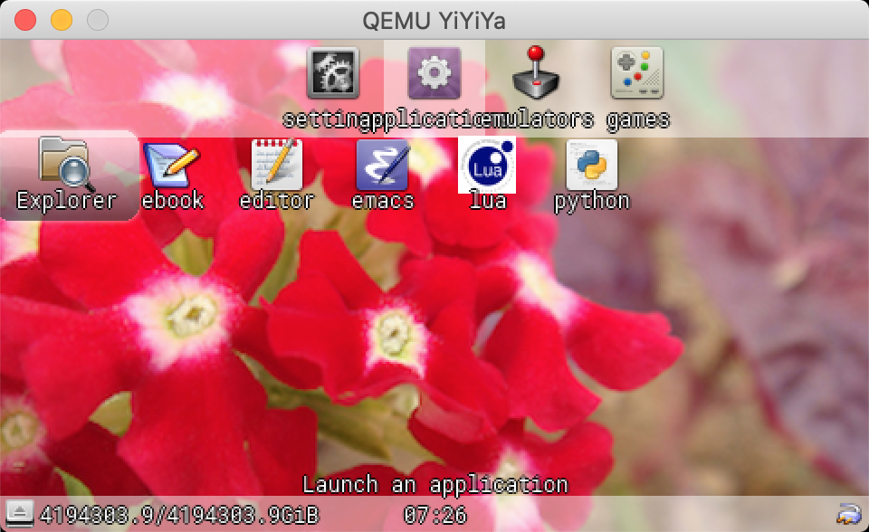
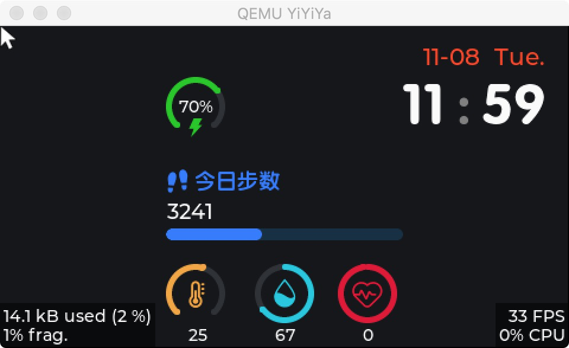
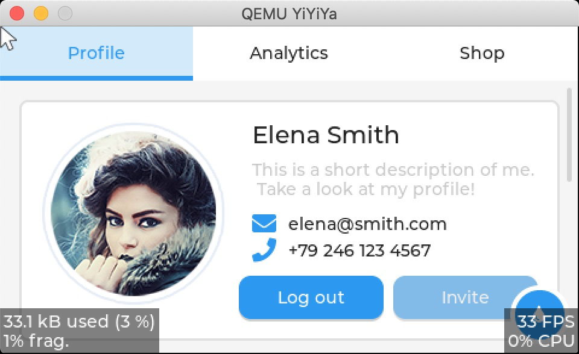
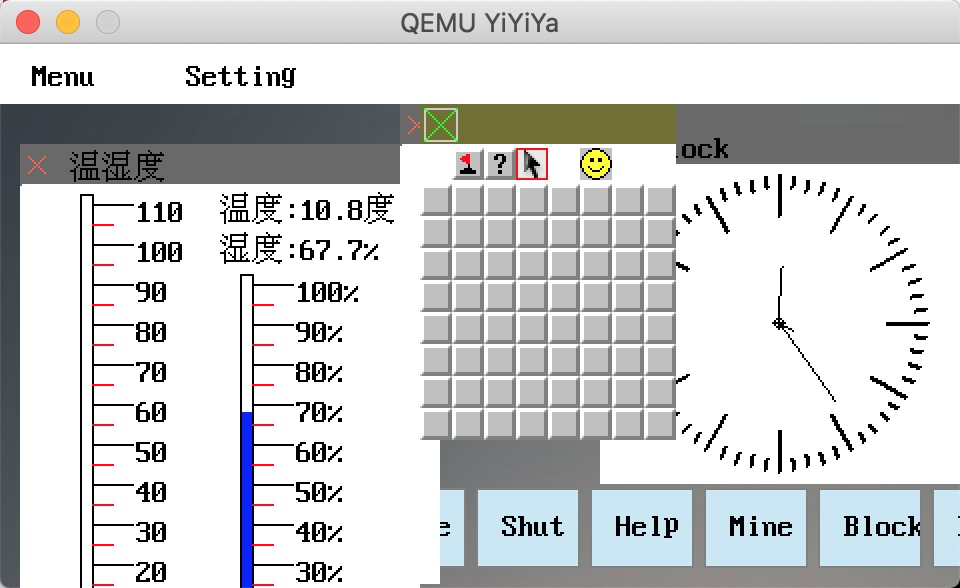
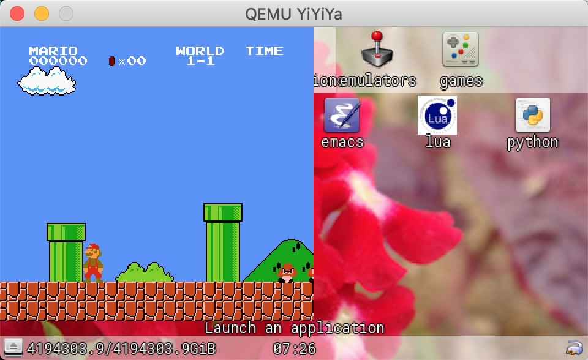
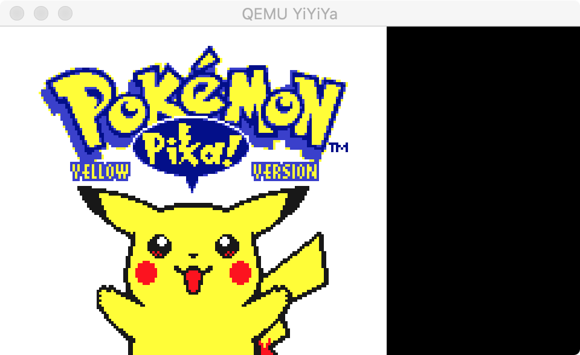
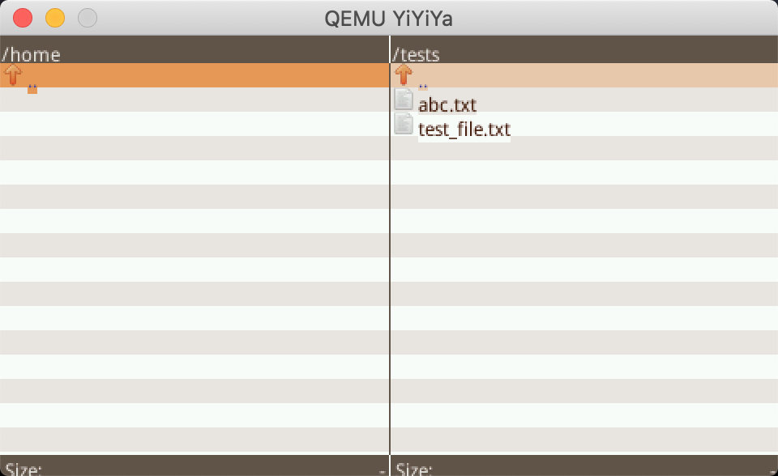

# 应用开发

在YiYiYa中应用开发，主要涉及到app目录和eggs目录。app目录是先有的各种应用集合。而eggs是很多基础库。

# 应用

1. gmenu2x 一个掌机设备使用的轻量级菜单小桌面

2.  watch手表

3. lvgl例子

4. etk自己写的桌面gui

5. infones模拟器

6. gnuboy模拟器，一个兼容性较好的模拟器

7. mgba 一个性能较好的模拟器

8. commander：一个轻量级文件管理器，支持查看编辑文件，运行程序

9. Doom：毁灭战士，卡马克大神开源的游戏

10. Picodrive：MD模拟器

11. Snes9x4D：SFC模拟器