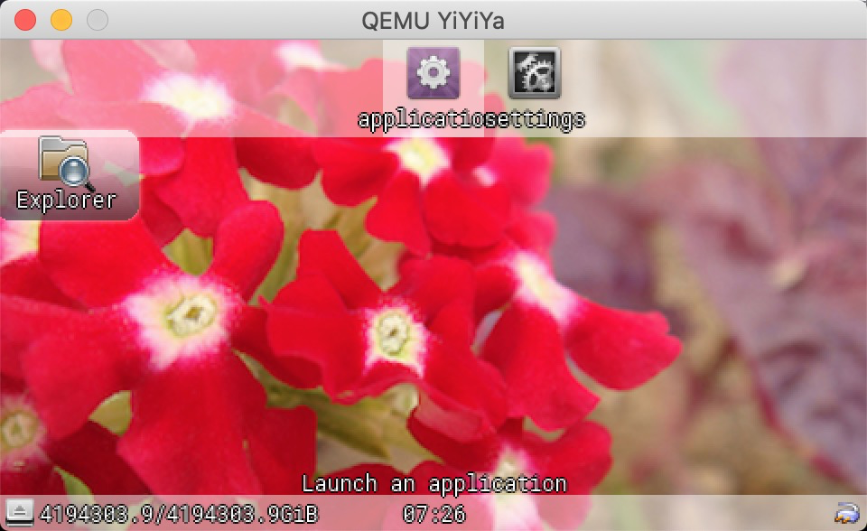

# 应用开发

在YiYiYa中应用开发，主要涉及到app目录和eggs目录。app目录是先有的各种应用集合。而eggs是很多基础库。

# 应用

1. gmenu2x 一个掌机设备使用的轻量级菜单小桌面

2. mgba 一个性能较好的模拟器

3. commander：一个轻量级文件管理器，支持查看编辑文件，运行程序

4. Doom：毁灭战士，卡马克大神开源的游戏

5. Picodrive：MD模拟器

6.Snes9x4D：SFC模拟器

