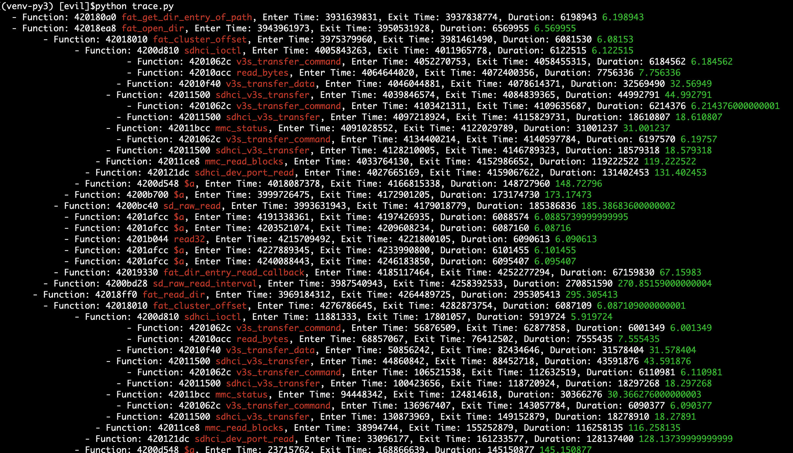

# trace 分析

当性能出现问题的时候，需要有内核跟踪工具，这时候轮到trace.c 出场了。

## 采样格式

e表示进去，x表示出去 ，l表示层级，f表示当前函数地址，c：表示调用者地址

```python
[2307730716] x t:2 f:4201062c c:42010fec l:12
[2313911798] e t:2 f:42010acc c:42011020 l:12
[2321670588] x t:2 f:42010acc c:42011020 l:12
[2327891827] x t:2 f:42010f40 c:42011570 l:11
[2334117955] x t:2 f:42011500 c:42011e1c l:10
[2340316073] e t:2 f:42011bcc c:42011e58 l:10
[2346500874] e t:2 f:42011500 c:42011c64 l:11
[2352697297] e t:2 f:4201062c c:42011558 l:12
[2358907995] x t:2 f:4201062c c:42011558 l:12
[2365093243] x t:2 f:42011500 c:42011c64 l:11
[2371294139] x t:2 f:42011bcc c:42011e58 l:10
[2377475110] e t:2 f:42011500 c:42011ed4 l:10
[2383679395] e t:2 f:4201062c c:42011558 l:11

```

##  采样代码

配置编译参数

```python
exclude_function_list='do_page_fault,syscall_handler,general_protection,syscall1,syscall2,syscall3,syscall4,syscall5,print_string,do_shell_cmd,print_promot'

exclude_file_list='duck/init,duck/arch,duck/libs,duck/init,duck/kernel/thread.c,duck/kernel/schedule.c,duck/kernel/syscall.c,duck/kernel/sysfn.c,duck/kernel/vfs.c,duck/kernel/devfn.c,duck/kernel/exceptions.c,duck/kernel/logger.c,duck/kernel/page.c,duck/kernel/memory.c,duck/kernel/vmemory.c,modules/serial/bcm2836.c,modules/serial/v3s.c'

cflags='$CFLAGS -finstrument-functions  -finstrument-functions-exclude-function-list=%s -finstrument-functions-exclude-file-list=%s '%(exclude_function_list,exclude_file_list) #-DUSE_POOL -finstrument-functions
```

加入代码trace.c

```c
#define NO_INSTRUMENT_FUNCTION __attribute__((__no_instrument_function__))

int enable_pmu = 0;
int trace_level = -1;

void NO_INSTRUMENT_FUNCTION __cyg_profile_func_enter(void *func, void *caller) {
  int tid = 0;
  thread_t *current = thread_current();
  if (current != NULL) {
    tid = current->id;
  }
  if (enable_pmu == 0) {
    cpu_pmu_enable();
    enable_pmu = 1;
  }
  trace_level++;
  u32 ticks = cpu_cyclecount();
  kprintf("[%010d] e t:%d f:%x c:%x l:%d\n", ticks, tid, func, caller,
          trace_level);
}

void NO_INSTRUMENT_FUNCTION __cyg_profile_func_exit(void *func, void *caller) {
  int tid = 0;
  thread_t *current = thread_current();
  if (current != NULL) {
    tid = current->id;
  }

  u32 ticks = cpu_cyclecount();
  kprintf("[%08d] x t:%d f:%x c:%x l:%d\n", ticks, tid, func, caller,trace_level);
  trace_level--;
}

```

## 运行显示

运行代码后，收集打印到trace.txt,使用工具tool/trace.py  运行，可以看到绿色部分就是性能消耗，数字越高，消耗越大。


效果图如下：




```bash
(venv-py3) [evil]$python trace.py 
  - Function: 420180a0 fat_get_dir_entry_of_path, Enter Time: 3931639831, Exit Time: 3937838774, Duration: 6198943 6.198943
  - Function: 42018ea8 fat_open_dir, Enter Time: 3943961973, Exit Time: 3950531928, Duration: 6569955 6.569955
        - Function: 42018010 fat_cluster_offset, Enter Time: 3975379960, Exit Time: 3981461490, Duration: 6081530 6.08153
              - Function: 4200d810 sdhci_ioctl, Enter Time: 4005843263, Exit Time: 4011965778, Duration: 6122515 6.122515
                        - Function: 4201062c v3s_transfer_command, Enter Time: 4052270753, Exit Time: 4058455315, Duration: 6184562 6.184562
                        - Function: 42010acc read_bytes, Enter Time: 4064644020, Exit Time: 4072400356, Duration: 7756336 7.756336
                      - Function: 42010f40 v3s_transfer_data, Enter Time: 4046044881, Exit Time: 4078614371, Duration: 32569490 32.56949
                    - Function: 42011500 sdhci_v3s_transfer, Enter Time: 4039846574, Exit Time: 4084839365, Duration: 44992791 44.992791
                        - Function: 4201062c v3s_transfer_command, Enter Time: 4103421311, Exit Time: 4109635687, Duration: 6214376 6.214376000000001
                      - Function: 42011500 sdhci_v3s_transfer, Enter Time: 4097218924, Exit Time: 4115829731, Duration: 18610807 18.610807
                    - Function: 42011bcc mmc_status, Enter Time: 4091028552, Exit Time: 4122029789, Duration: 31001237 31.001237
                      - Function: 4201062c v3s_transfer_command, Enter Time: 4134400214, Exit Time: 4140597784, Duration: 6197570 6.19757
                    - Function: 42011500 sdhci_v3s_transfer, Enter Time: 4128210005, Exit Time: 4146789323, Duration: 18579318 18.579318
                  - Function: 42011ce8 mmc_read_blocks, Enter Time: 4033764130, Exit Time: 4152986652, Duration: 119222522 119.222522
                - Function: 420121dc sdhci_dev_port_read, Enter Time: 4027665169, Exit Time: 4159067622, Duration: 131402453 131.402453
              - Function: 4200d548 $a, Enter Time: 4018087378, Exit Time: 4166815338, Duration: 148727960 148.72796
            - Function: 4200b700 $a, Enter Time: 3999726475, Exit Time: 4172901205, Duration: 173174730 173.17473
          - Function: 4200bc40 sd_raw_read, Enter Time: 3993631943, Exit Time: 4179018779, Duration: 185386836 185.38683600000002
            - Function: 4201afcc $a, Enter Time: 4191338361, Exit Time: 4197426935, Duration: 6088574 6.0885739999999995
            - Function: 4201afcc $a, Enter Time: 4203521074, Exit Time: 4209608234, Duration: 6087160 6.08716
            - Function: 4201b044 read32, Enter Time: 4215709492, Exit Time: 4221800105, Duration: 6090613 6.090613
            - Function: 4201afcc $a, Enter Time: 4227889345, Exit Time: 4233990800, Duration: 6101455 6.101455
            - Function: 4201afcc $a, Enter Time: 4240088443, Exit Time: 4246183850, Duration: 6095407 6.095407
          - Function: 42019330 fat_dir_entry_read_callback, Enter Time: 4185117464, Exit Time: 4252277294, Duration: 67159830 67.15983
        - Function: 4200bd28 sd_raw_read_interval, Enter Time: 3987540943, Exit Time: 4258392533, Duration: 270851590 270.85159000000004
      - Function: 42018ff0 fat_read_dir, Enter Time: 3969184312, Exit Time: 4264489725, Duration: 295305413 295.305413
        - Function: 42018010 fat_cluster_offset, Enter Time: 4276786645, Exit Time: 4282873754, Duration: 6087109 6.087109000000001
              - Function: 4200d810 sdhci_ioctl, Enter Time: 11881333, Exit Time: 17801057, Duration: 5919724 5.919724
                        - Function: 4201062c v3s_transfer_command, Enter Time: 56876509, Exit Time: 62877858, Duration: 6001349 6.001349
                        - Function: 42010acc read_bytes, Enter Time: 68857067, Exit Time: 76412502, Duration: 7555435 7.555435
                      - Function: 42010f40 v3s_transfer_data, Enter Time: 50856242, Exit Time: 82434646, Duration: 31578404 31.578404
                    - Function: 42011500 sdhci_v3s_transfer, Enter Time: 44860842, Exit Time: 88452718, Duration: 43591876 43.591876
                        - Function: 4201062c v3s_transfer_command, Enter Time: 106521538, Exit Time: 112632519, Duration: 6110981 6.110981
                      - Function: 42011500 sdhci_v3s_transfer, Enter Time: 100423656, Exit Time: 118720924, Duration: 18297268 18.297268
                    - Function: 42011bcc mmc_status, Enter Time: 94448342, Exit Time: 124814618, Duration: 30366276 30.366276000000003
                      - Function: 4201062c v3s_transfer_command, Enter Time: 136967407, Exit Time: 143057784, Duration: 6090377 6.090377
                    - Function: 42011500 sdhci_v3s_transfer, Enter Time: 130873969, Exit Time: 149152879, Duration: 18278910 18.27891
                  - Function: 42011ce8 mmc_read_blocks, Enter Time: 38994744, Exit Time: 155252879, Duration: 116258135 116.258135
                - Function: 420121dc sdhci_dev_port_read, Enter Time: 33096177, Exit Time: 161233577, Duration: 128137400 128.13739999999999
              - Function: 4200d548 $a, Enter Time: 23715762, Exit Time: 168866639, Duration: 145150877 145.150877
            - Function: 4200b700 $a, Enter Time: 5969334, Exit Time: 174833859, Duration: 168864525 168.864525
          - Function: 4200bc40 sd_raw_read, Enter Time: 84348, Exit Time: 180848500, Duration: 180764152 180.764152
          - Function: 42019330 fat_dir_entry_read_callback, Enter Time: 186845587, Exit Time: 192976753, Duration: 6131166 6.131166
              - Function: 4200d810 sdhci_ioctl, Enter Time: 211006701, Exit Time: 217013545, Duration: 6006844 6.006844
                        - Function: 4201062c v3s_transfer_command, Enter Time: 256663615, Exit Time: 262762353, Duration: 6098738 6.098738
                        - Function: 42010acc read_bytes, Enter Time: 268847402, Exit Time: 276487263, Duration: 7639861 7.639861
                      - Function: 42010f40 v3s_transfer_data, Enter Time: 250537295, Exit Time: 282608797, Duration: 32071502 32.071502
                    - Function: 42011500 sdhci_v3s_transfer, Enter Time: 244448487, Exit Time: 288727825, Duration: 44279338 44.279338
                        - Function: 4201062c v3s_transfer_command, Enter Time: 307016407, Exit Time: 313120527, Duration: 6104120 6.10412
                      - Function: 42011500 sdhci_v3s_transfer, Enter Time: 300915738, Exit Time: 319212895, Duration: 18297157 18.297157
                    - Function: 42011bcc mmc_status, Enter Time: 294831863, Exit Time: 325303796, Duration: 30471933 30.471933
                      - Function: 4201062c v3s_transfer_command, Enter Time: 337486258, Exit Time: 343580718, Duration: 6094460 6.09446
                    - Function: 42011500 sdhci_v3s_transfer, Enter Time: 331389091, Exit Time: 349675690, Duration: 18286599 18.286599
                  - Function: 42011ce8 mmc_read_blocks, Enter Time: 238472754, Exit Time: 355771547, Duration: 117298793 117.298793
                - Function: 420121dc sdhci_dev_port_read, Enter Time: 232482414, Exit Time: 361749842, Duration: 129267428 129.267428
              - Function: 4200d548 $a, Enter Time: 223025244, Exit Time: 369387710, Duration: 146362466 146.36246599999998
            - Function: 4200b700 $a, Enter Time: 204986016, Exit Time: 375370719, Duration: 170384703 170.384703
          - Function: 4200bc40 sd_raw_read, Enter Time: 198995263, Exit Time: 381393484, Duration: 182398221 182.39822099999998
          - Function: 42019330 fat_dir_entry_read_callback, Enter Time: 387388339, Exit Time: 393443923, Duration: 6055584 6.055584
              - Function: 4200d810 sdhci_ioctl, Enter Time: 411464418, Exit Time: 417484576, Duration: 6020158 6.020158
                        - Function: 4201062c v3s_transfer_command, Enter Time: 457155997, Exit Time: 463264407, Duration: 6108410 6.10841
                        - Function: 42010acc read_bytes, Enter Time: 469340507, Exit Time: 476994519, Duration: 7654012 7.654012
                      - Function: 42010f40 v3s_transfer_data, Enter Time: 451028030, Exit Time: 483116998, Duration: 32088968 32.088968
                    - Function: 42011500 sdhci_v3s_transfer, Enter Time: 444935562, Exit Time: 489235525, Duration: 44299963 44.299963000000005
                        - Function: 4201062c v3s_transfer_command, Enter Time: 507501241, Exit Time: 513612516, Duration: 6111275 6.111275
                      - Function: 42011500 sdhci_v3s_transfer, Enter Time: 501410676, Exit Time: 519699736, Duration: 18289060 18.289060000000003
                    - Function: 42011bcc mmc_status, Enter Time: 495332192, Exit Time: 525799750, Duration: 30467558 30.467558
                      - Function: 4201062c v3s_transfer_command, Enter Time: 537980044, Exit Time: 544075086, Duration: 6095042 6.095042
                    - Function: 42011500 sdhci_v3s_transfer, Enter Time: 531881803, Exit Time: 550167991, Duration: 18286188 18.286188
                  - Function: 42011ce8 mmc_read_blocks, Enter Time: 438959862, Exit Time: 556260293, Duration: 117300431 117.300431
                - Function: 420121dc sdhci_dev_port_read, Enter Time: 432967158, Exit Time: 562213808, Duration: 129246650 129.24665
              - Function: 4200d548 $a, Enter Time: 423496782, Exit Time: 569851517, Duration: 146354735 146.35473499999998
            - Function: 4200b700 $a, Enter Time: 405453060, Exit Time: 575833236, Duration: 170380176 170.380176
          - Function: 4200bc40 sd_raw_read, Enter Time: 399456466, Exit Time: 581849983, Duration: 182393517 182.393517
            - Function: 42019868 fat_calc_83_checksum, Enter Time: 593860909, Exit Time: 599896486, Duration: 6035577 6.035577
            - Function: 4201afcc $a, Enter Time: 605913466, Exit Time: 611908693, Duration: 5995227 5.995227
            - Function: 4201afcc $a, Enter Time: 617908377, Exit Time: 623904088, Duration: 5995711 5.995711
            - Function: 4201b044 read32, Enter Time: 629901057, Exit Time: 635899081, Duration: 5998024 5.998024
            - Function: 4201afcc $a, Enter Time: 641897292, Exit Time: 647884537, Duration: 5987245 5.987245
            - Function: 4201afcc $a, Enter Time: 653877534, Exit Time: 659863102, Duration: 5985568 5.985568
          - Function: 42019330 fat_dir_entry_read_callback, Enter Time: 587844367, Exit Time: 665857042, Duration: 78012675 78.012675
        - Function: 4200bd28 sd_raw_read_interval, Enter Time: 4288956794, Exit Time: 671873639, Duration: -3617083155 -3617.083155
      - Function: 42018ff0 fat_read_dir, Enter Time: 4270585847, Exit Time: 677872106, Duration: -3592713741 -3592.713741
        - Function: 42018010 fat_cluster_offset, Enter Time: 689967001, Exit Time: 695943298, Duration: 5976297 5.976297
              - Function: 4200d810 sdhci_ioctl, Enter Time: 719896477, Exit Time: 725913590, Duration: 6017113 6.017113
                        - Function: 4201062c v3s_transfer_command, Enter Time: 765572163, Exit Time: 771673329, Duration: 6101166 6.101166
                        - Function: 42010acc read_bytes, Enter Time: 777738773, Exit Time: 785384835, Duration: 7646062 7.646062
                      - Function: 42010f40 v3s_transfer_data, Enter Time: 759445007, Exit Time: 791503066, Duration: 32058059 32.058059
                    - Function: 42011500 sdhci_v3s_transfer, Enter Time: 753356370, Exit Time: 797626108, Duration: 44269738 44.269738
                        - Function: 4201062c v3s_transfer_command, Enter Time: 815899558, Exit Time: 821995848, Duration: 6096290 6.09629
                      - Function: 42011500 sdhci_v3s_transfer, Enter Time: 809801190, Exit Time: 828088030, Duration: 18286840 18.28684
                    - Function: 42011bcc mmc_status, Enter Time: 803727641, Exit Time: 834184718, Duration: 30457077 30.457077
                      - Function: 4201062c v3s_transfer_command, Enter Time: 846368137, Exit Time: 852460926, Duration: 6092789 6.092789
                    - Function: 42011500 sdhci_v3s_transfer, Enter Time: 840268333, Exit Time: 858555904, Duration: 18287571 18.287571
                  - Function: 42011ce8 mmc_read_blocks, Enter Time: 747373740, Exit Time: 864644168, Duration: 117270428 117.270428
                - Function: 420121dc sdhci_dev_port_read, Enter Time: 741378743, Exit Time: 870623918, Duration: 129245175 129.245175
              - Function: 4200d548 $a, Enter Time: 731930850, Exit Time: 878270606, Duration: 146339756 146.339756
            - Function: 4200b700 $a, Enter Time: 713885478, Exit Time: 884256312, Duration: 170370834 170.370834
          - Function: 4200bc40 sd_raw_read, Enter Time: 707900657, Exit Time: 890277178, Duration: 182376521 182.376521
          - Function: 42019330 fat_dir_entry_read_callback, Enter Time: 896264740, Exit Time: 902402902, Duration: 6138162 6.138162
              - Function: 4200d810 sdhci_ioctl, Enter Time: 920435727, Exit Time: 926457313, Duration: 6021586 6.021586
                        - Function: 4201062c v3s_transfer_command, Enter Time: 966137091, Exit Time: 972216945, Duration: 6079854 6.079854
                        - Function: 42010acc read_bytes, Enter Time: 978301793, Exit Time: 985947678, Duration: 7645885 7.645885
                      - Function: 42010f40 v3s_transfer_data, Enter Time: 960012515, Exit Time: 992068534, Duration: 32056019 32.056019
                    - Function: 42011500 sdhci_v3s_transfer, Enter Time: 953913186, Exit Time: 998191312, Duration: 44278126 44.27812599999999
                        - Function: 4201062c v3s_transfer_command, Enter Time: 1016663602, Exit Time: 1022879637, Duration: 6216035 6.216035
                      - Function: 42011500 sdhci_v3s_transfer, Enter Time: 1010466561, Exit Time: 1029078499, Duration: 18611938 18.611938
                    - Function: 42011bcc mmc_status, Enter Time: 1004284397, Exit Time: 1035280019, Duration: 30995622 30.995622
                      - Function: 4201062c v3s_transfer_command, Enter Time: 1047652684, Exit Time: 1053849639, Duration: 6196955 6.196955
                    - Function: 42011500 sdhci_v3s_transfer, Enter Time: 1041462763, Exit Time: 1060036987, Duration: 18574224 18.574223999999997
                  - Function: 42011ce8 mmc_read_blocks, Enter Time: 947935020, Exit Time: 1066239731, Duration: 118304711 118.304711
                - Function: 420121dc sdhci_dev_port_read, Enter Time: 941944018, Exit Time: 1072320626, Duration: 130376608 130.376608
              - Function: 4200d548 $a, Enter Time: 932474034, Exit Time: 1080064655, Duration: 147590621 147.59062100000003
            - Function: 4200b700 $a, Enter Time: 914413626, Exit Time: 1086147852, Duration: 171734226 171.734226
          - Function: 4200bc40 sd_raw_read, Enter Time: 908421037, Exit Time: 1092260956, Duration: 183839919 183.83991899999998
            - Function: 42019868 fat_calc_83_checksum, Enter Time: 1104469222, Exit Time: 1110610537, Duration: 6141315 6.141315
            - Function: 4201afcc $a, Enter Time: 1116738322, Exit Time: 1122827548, Duration: 6089226 6.089226
            - Function: 4201afcc $a, Enter Time: 1128926352, Exit Time: 1135023301, Duration: 6096949 6.0969489999999995
            - Function: 4201b044 read32, Enter Time: 1141116627, Exit Time: 1147213663, Duration: 6097036 6.097036
            - Function: 4201afcc $a, Enter Time: 1153312392, Exit Time: 1159411531, Duration: 6099139 6.099139
            - Function: 4201afcc $a, Enter Time: 1165501095, Exit Time: 1171592824, Duration: 6091729 6.091729
          - Function: 42019330 fat_dir_entry_read_callback, Enter Time: 1098351757, Exit Time: 1177681642, Duration: 79329885 79.32988499999999
        - Function: 4200bd28 sd_raw_read_interval, Enter Time: 701905304, Exit Time: 1183798865, Duration: 481893561 481.893561
      - Function: 42018ff0 fat_read_dir, Enter Time: 683870925, Exit Time: 1189895492, Duration: 506024567 506.024567
        - Function: 42018010 fat_cluster_offset, Enter Time: 1202198368, Exit Time: 1208280829, Duration: 6082461 6.082461
              - Function: 4200d810 sdhci_ioctl, Enter Time: 1232664151, Exit Time: 1238788154, Duration: 6124003 6.124003
                        - Function: 4201062c v3s_transfer_command, Enter Time: 1279088908, Exit Time: 1285274538, Duration: 6185630 6.18563
                        - Function: 42010acc read_bytes, Enter Time: 1291465082, Exit Time: 1299218511, Duration: 7753429 7.753429
                      - Function: 42010f40 v3s_transfer_data, Enter Time: 1272859166, Exit Time: 1305443491, Duration: 32584325 32.584325
                    - Function: 42011500 sdhci_v3s_transfer, Enter Time: 1266662355, Exit Time: 1311671920, Duration: 45009565 45.009565
                        - Function: 4201062c v3s_transfer_command, Enter Time: 1330234846, Exit Time: 1336444815, Duration: 6209969 6.209969
                      - Function: 42011500 sdhci_v3s_transfer, Enter Time: 1324042056, Exit Time: 1342639858, Duration: 18597802 18.597801999999998
                    - Function: 42011bcc mmc_status, Enter Time: 1317862463, Exit Time: 1348841168, Duration: 30978705 30.978705
                      - Function: 4201062c v3s_transfer_command, Enter Time: 1361202625, Exit Time: 1367401743, Duration: 6199118 6.199118
                    - Function: 42011500 sdhci_v3s_transfer, Enter Time: 1355018995, Exit Time: 1373593258, Duration: 18574263 18.574263
                  - Function: 42011ce8 mmc_read_blocks, Enter Time: 1260582072, Exit Time: 1379790545, Duration: 119208473 119.208473
                - Function: 420121dc sdhci_dev_port_read, Enter Time: 1254486873, Exit Time: 1385867822, Duration: 131380949 131.380949
              - Function: 4200d548 $a, Enter Time: 1244909319, Exit Time: 1393616441, Duration: 148707122 148.707122
            - Function: 4200b700 $a, Enter Time: 1226547339, Exit Time: 1399699245, Duration: 173151906 173.151906
          - Function: 4200bc40 sd_raw_read, Enter Time: 1220449445, Exit Time: 1405816162, Duration: 185366717 185.366717
          - Function: 42019330 fat_dir_entry_read_callback, Enter Time: 1411910737, Exit Time: 1418146141, Duration: 6235404 6.235404000000001
              - Function: 4200d810 sdhci_ioctl, Enter Time: 1436486484, Exit Time: 1442608015, Duration: 6121531 6.121531
                        - Function: 4201062c v3s_transfer_command, Enter Time: 1482908356, Exit Time: 1489114833, Duration: 6206477 6.206477
                        - Function: 42010acc read_bytes, Enter Time: 1495294610, Exit Time: 1503041019, Duration: 7746409 7.746409
                      - Function: 42010f40 v3s_transfer_data, Enter Time: 1476675281, Exit Time: 1509262735, Duration: 32587454 32.587454
                    - Function: 42011500 sdhci_v3s_transfer, Enter Time: 1470476709, Exit Time: 1515489565, Duration: 45012856 45.012856
                        - Function: 4201062c v3s_transfer_command, Enter Time: 1534060756, Exit Time: 1540264491, Duration: 6203735 6.203735
                      - Function: 42011500 sdhci_v3s_transfer, Enter Time: 1527869367, Exit Time: 1546457977, Duration: 18588610 18.58861
                    - Function: 42011bcc mmc_status, Enter Time: 1521682967, Exit Time: 1552655465, Duration: 30972498 30.972497999999998
                      - Function: 4201062c v3s_transfer_command, Enter Time: 1565029819, Exit Time: 1571223825, Duration: 6194006 6.194006
                    - Function: 42011500 sdhci_v3s_transfer, Enter Time: 1558834765, Exit Time: 1577409265, Duration: 18574500 18.5745
                  - Function: 42011ce8 mmc_read_blocks, Enter Time: 1464402891, Exit Time: 1583605997, Duration: 119203106 119.203106
                - Function: 420121dc sdhci_dev_port_read, Enter Time: 1458302181, Exit Time: 1589682329, Duration: 131380148 131.380148
              - Function: 4200d548 $a, Enter Time: 1448720382, Exit Time: 1597433876, Duration: 148713494 148.713494
            - Function: 4200b700 $a, Enter Time: 1430372370, Exit Time: 1603508085, Duration: 173135715 173.135715
          - Function: 4200bc40 sd_raw_read, Enter Time: 1424272162, Exit Time: 1609618687, Duration: 185346525 185.34652499999999
          - Function: 42019330 fat_dir_entry_read_callback, Enter Time: 1615712299, Exit Time: 1621869943, Duration: 6157644 6.157644
              - Function: 4200d810 sdhci_ioctl, Enter Time: 1640195418, Exit Time: 1646321995, Duration: 6126577 6.126577
                        - Function: 4201062c v3s_transfer_command, Enter Time: 1686592840, Exit Time: 1692804066, Duration: 6211226 6.211226
                        - Function: 42010acc read_bytes, Enter Time: 1698981800, Exit Time: 1706737212, Duration: 7755412 7.755412000000001
                      - Function: 42010f40 v3s_transfer_data, Enter Time: 1680364586, Exit Time: 1712959150, Duration: 32594564 32.594564
                    - Function: 42011500 sdhci_v3s_transfer, Enter Time: 1674167439, Exit Time: 1719184042, Duration: 45016603 45.016603
                        - Function: 4201062c v3s_transfer_command, Enter Time: 1737756799, Exit Time: 1743967584, Duration: 6210785 6.210785
                      - Function: 42011500 sdhci_v3s_transfer, Enter Time: 1731559470, Exit Time: 1750150543, Duration: 18591073 18.591073
                    - Function: 42011bcc mmc_status, Enter Time: 1725379607, Exit Time: 1756345273, Duration: 30965666 30.965666000000002
                      - Function: 4201062c v3s_transfer_command, Enter Time: 1768720981, Exit Time: 1774918956, Duration: 6197975 6.1979750000000005
                    - Function: 42011500 sdhci_v3s_transfer, Enter Time: 1762521934, Exit Time: 1781106475, Duration: 18584541 18.584541
                  - Function: 42011ce8 mmc_read_blocks, Enter Time: 1668103680, Exit Time: 1787310179, Duration: 119206499 119.206499
                - Function: 420121dc sdhci_dev_port_read, Enter Time: 1662004700, Exit Time: 1793378399, Duration: 131373699 131.373699
              - Function: 4200d548 $a, Enter Time: 1652435379, Exit Time: 1801126700, Duration: 148691321 148.691321
            - Function: 4200b700 $a, Enter Time: 1634080857, Exit Time: 1807204638, Duration: 173123781 173.12378099999998
          - Function: 4200bc40 sd_raw_read, Enter Time: 1627988923, Exit Time: 1813324288, Duration: 185335365 185.335365
            - Function: 42019868 fat_calc_83_checksum, Enter Time: 1825527298, Exit Time: 1831665037, Duration: 6137739 6.137739
            - Function: 4201afcc $a, Enter Time: 1837785166, Exit Time: 1843883809, Duration: 6098643 6.098643
            - Function: 4201afcc $a, Enter Time: 1849983117, Exit Time: 1856074831, Duration: 6091714 6.091714
            - Function: 4201b044 read32, Enter Time: 1862171199, Exit Time: 1868261398, Duration: 6090199 6.090198999999999
            - Function: 4201afcc $a, Enter Time: 1874355927, Exit Time: 1880449360, Duration: 6093433 6.093433
            - Function: 4201afcc $a, Enter Time: 1886551494, Exit Time: 1892650174, Duration: 6098680 6.09868
          - Function: 42019330 fat_dir_entry_read_callback, Enter Time: 1819419439, Exit Time: 1898745403, Duration: 79325964 79.32596400000001
        - Function: 4200bd28 sd_raw_read_interval, Enter Time: 1214358479, Exit Time: 1904866298, Duration: 690507819 690.507819
      - Function: 42018ff0 fat_read_dir, Enter Time: 1195997118, Exit Time: 1910960417, Duration: 714963299 714.963299
        - Function: 42018010 fat_cluster_offset, Enter Time: 1923251356, Exit Time: 1929333895, Duration: 6082539 6.082539
              - Function: 4200d810 sdhci_ioctl, Enter Time: 1953734710, Exit Time: 1959851966, Duration: 6117256 6.117256
                        - Function: 4201062c v3s_transfer_command, Enter Time: 2000121793, Exit Time: 2006323614, Duration: 6201821 6.201821
                        - Function: 42010acc read_bytes, Enter Time: 2012504693, Exit Time: 2020255353, Duration: 7750660 7.75066
                      - Function: 42010f40 v3s_transfer_data, Enter Time: 1993894628, Exit Time: 2026482034, Duration: 32587406 32.587406
                    - Function: 42011500 sdhci_v3s_transfer, Enter Time: 1987699479, Exit Time: 2032706275, Duration: 45006796 45.006796
                        - Function: 4201062c v3s_transfer_command, Enter Time: 2051274679, Exit Time: 2057488041, Duration: 6213362 6.213362
                      - Function: 42011500 sdhci_v3s_transfer, Enter Time: 2045082072, Exit Time: 2063678578, Duration: 18596506 18.596506
                    - Function: 42011bcc mmc_status, Enter Time: 2038901357, Exit Time: 2069877278, Duration: 30975921 30.975921
                      - Function: 4201062c v3s_transfer_command, Enter Time: 2082255649, Exit Time: 2088452400, Duration: 6196751 6.196751
                    - Function: 42011500 sdhci_v3s_transfer, Enter Time: 2076058027, Exit Time: 2094642055, Duration: 18584028 18.584028
                  - Function: 42011ce8 mmc_read_blocks, Enter Time: 1981634505, Exit Time: 2100839204, Duration: 119204699 119.20469899999999
                - Function: 420121dc sdhci_dev_port_read, Enter Time: 1975534566, Exit Time: 2106905279, Duration: 131370713 131.370713
              - Function: 4200d548 $a, Enter Time: 1965966537, Exit Time: 2114653877, Duration: 148687340 148.68734
            - Function: 4200b700 $a, Enter Time: 1947618249, Exit Time: 2120728701, Duration: 173110452 173.11045199999998
          - Function: 4200bc40 sd_raw_read, Enter Time: 1941517406, Exit Time: 2126845570, Duration: 185328164 185.328164
            - Function: 4201afcc $a, Enter Time: 2139193993, Exit Time: 2145290239, Duration: 6096246 6.096246
            - Function: 4201afcc $a, Enter Time: 2151391554, Exit Time: 2157487123, Duration: 6095569 6.095569
            - Function: 4201b044 read32, Enter Time: 2163586197, Exit Time: 2169676960, Duration: 6090763 6.090763
            - Function: 4201afcc $a, Enter Time: 2175773994, Exit Time: 2181858244, Duration: 6084250 6.08425
            - Function: 4201afcc $a, Enter Time: 2187953748, Exit Time: 2194046710, Duration: 6092962 6.092962000000001
          - Function: 42019330 fat_dir_entry_read_callback, Enter Time: 2132938345, Exit Time: 2200141231, Duration: 67202886 67.20288599999999
        - Function: 4200bd28 sd_raw_read_interval, Enter Time: 1935416294, Exit Time: 2206263859, Duration: 270847565 270.847565
      - Function: 42018ff0 fat_read_dir, Enter Time: 1917054609, Exit Time: 2212352297, Duration: 295297688 295.29768800000005
        - Function: 42018010 fat_cluster_offset, Enter Time: 2224638342, Exit Time: 2230725409, Duration: 6087067 6.087067
              - Function: 4200d810 sdhci_ioctl, Enter Time: 2255116882, Exit Time: 2261244479, Duration: 6127597 6.127597
                        - Function: 4201062c v3s_transfer_command, Enter Time: 2301525931, Exit Time: 2307730716, Duration: 6204785 6.204785
                        - Function: 42010acc read_bytes, Enter Time: 2313911798, Exit Time: 2321670588, Duration: 7758790 7.75879
                      - Function: 42010f40 v3s_transfer_data, Enter Time: 2295298337, Exit Time: 2327891827, Duration: 32593490 32.59349
                    - Function: 42011500 sdhci_v3s_transfer, Enter Time: 2289101667, Exit Time: 2334117955, Duration: 45016288 45.016288
                        - Function: 4201062c v3s_transfer_command, Enter Time: 2352697297, Exit Time: 2358907995, Duration: 6210698 6.210698000000001
                      - Function: 42011500 sdhci_v3s_transfer, Enter Time: 2346500874, Exit Time: 2365093243, Duration: 18592369 18.592368999999998
                    - Function: 42011bcc mmc_status, Enter Time: 2340316073, Exit Time: 2371294139, Duration: 30978066 30.978066
                      - Function: 4201062c v3s_transfer_command, Enter Time: 2383679395, Exit Time: 2389874580, Duration: 6195185 6.195185
                    - Function: 42011500 sdhci_v3s_transfer, Enter Time: 2377475110, Exit Time: 2396067352, Duration: 18592242 18.592242
                  - Function: 42011ce8 mmc_read_blocks, Enter Time: 2283034479, Exit Time: 2402266601, Duration: 119232122 119.232122
                - Function: 420121dc sdhci_dev_port_read, Enter Time: 2276937600, Exit Time: 2408322731, Duration: 131385131 131.385131
              - Function: 4200d548 $a, Enter Time: 2267366766, Exit Time: 2416072373, Duration: 148705607 148.705607
            - Function: 4200b700 $a, Enter Time: 2248999632, Exit Time: 2422153983, Duration: 173154351 173.154351
          - Function: 4200bc40 sd_raw_read, Enter Time: 2242901567, Exit Time: 2428272685, Duration: 185371118 185.371118
            - Function: 4201afcc $a, Enter Time: 2440627209, Exit Time: 2446726759, Duration: 6099550 6.09955
            - Function: 4201afcc $a, Enter Time: 2452820151, Exit Time: 2458912438, Duration: 6092287 6.092287000000001
            - Function: 4201b044 read32, Enter Time: 2465017125, Exit Time: 2471116108, Duration: 6098983 6.0989830000000005
            - Function: 4201afcc $a, Enter Time: 2477208342, Exit Time: 2483295817, Duration: 6087475 6.087475
            - Function: 4201afcc $a, Enter Time: 2489391159, Exit Time: 2495483416, Duration: 6092257 6.092257
          - Function: 42019330 fat_dir_entry_read_callback, Enter Time: 2434372771, Exit Time: 2501580997, Duration: 67208226 67.208226
        - Function: 4200bd28 sd_raw_read_interval, Enter Time: 2236803112, Exit Time: 2507700028, Duration: 270896916 270.89691600000003
      - Function: 42018ff0 fat_read_dir, Enter Time: 2218450110, Exit Time: 2513803676, Duration: 295353566 295.353566
        - Function: 42018010 fat_cluster_offset, Enter Time: 2526092623, Exit Time: 2532175033, Duration: 6082410 6.082409999999999
              - Function: 4200d810 sdhci_ioctl, Enter Time: 2556557080, Exit Time: 2562681746, Duration: 6124666 6.124666
                        - Function: 4201062c v3s_transfer_command, Enter Time: 2602952473, Exit Time: 2609154855, Duration: 6202382 6.202381999999999
                        - Function: 42010acc read_bytes, Enter Time: 2615336918, Exit Time: 2623095690, Duration: 7758772 7.758772
                      - Function: 42010f40 v3s_transfer_data, Enter Time: 2596731698, Exit Time: 2629322146, Duration: 32590448 32.590448
                    - Function: 42011500 sdhci_v3s_transfer, Enter Time: 2590525383, Exit Time: 2635538473, Duration: 45013090 45.01309
                        - Function: 4201062c v3s_transfer_command, Enter Time: 2654113957, Exit Time: 2660325321, Duration: 6211364 6.211364
                      - Function: 42011500 sdhci_v3s_transfer, Enter Time: 2647918101, Exit Time: 2666517433, Duration: 18599332 18.599331999999997
                    - Function: 42011bcc mmc_status, Enter Time: 2641736984, Exit Time: 2672715824, Duration: 30978840 30.97884
                      - Function: 4201062c v3s_transfer_command, Enter Time: 2685080137, Exit Time: 2691276660, Duration: 6196523 6.196523
                    - Function: 42011500 sdhci_v3s_transfer, Enter Time: 2678882482, Exit Time: 2697471868, Duration: 18589386 18.589385999999998
                  - Function: 42011ce8 mmc_read_blocks, Enter Time: 2584452447, Exit Time: 2703666362, Duration: 119213915 119.213915
                - Function: 420121dc sdhci_dev_port_read, Enter Time: 2578349448, Exit Time: 2709732173, Duration: 131382725 131.382725
              - Function: 4200d548 $a, Enter Time: 2568796332, Exit Time: 2717467679, Duration: 148671347 148.671347
            - Function: 4200b700 $a, Enter Time: 2550434613, Exit Time: 2723545551, Duration: 173110938 173.110938
          - Function: 4200bc40 sd_raw_read, Enter Time: 2544340442, Exit Time: 2729667076, Duration: 185326634 185.32663399999998
            - Function: 4201afcc $a, Enter Time: 2741986399, Exit Time: 2748082777, Duration: 6096378 6.096378
            - Function: 4201afcc $a, Enter Time: 2754168819, Exit Time: 2760261355, Duration: 6092536 6.092536
            - Function: 4201b044 read32, Enter Time: 2766355899, Exit Time: 2772453064, Duration: 6097165 6.097165
            - Function: 4201afcc $a, Enter Time: 2778550338, Exit Time: 2784643750, Duration: 6093412 6.093412
            - Function: 4201afcc $a, Enter Time: 2790740076, Exit Time: 2796828901, Duration: 6088825 6.088825
          - Function: 42019330 fat_dir_entry_read_callback, Enter Time: 2735763496, Exit Time: 2802921265, Duration: 67157769 67.157769
        - Function: 4200bd28 sd_raw_read_interval, Enter Time: 2538238379, Exit Time: 2809040944, Duration: 270802565 270.802565
      - Function: 42018ff0 fat_read_dir, Enter Time: 2519905461, Exit Time: 2815141916, Duration: 295236455 295.23645500000003
        - Function: 42018010 fat_cluster_offset, Enter Time: 2827439701, Exit Time: 2833521640, Duration: 6081939 6.081939
              - Function: 4200d810 sdhci_ioctl, Enter Time: 2857893043, Exit Time: 2864016401, Duration: 6123358 6.1233580000000005
                        - Function: 4201062c v3s_transfer_command, Enter Time: 2904286738, Exit Time: 2910488106, Duration: 6201368 6.201368
                        - Function: 42010acc read_bytes, Enter Time: 2916659240, Exit Time: 2924416023, Duration: 7756783 7.756783
                      - Function: 42010f40 v3s_transfer_data, Enter Time: 2898060557, Exit Time: 2930639809, Duration: 32579252 32.579252000000004
                    - Function: 42011500 sdhci_v3s_transfer, Enter Time: 2891864463, Exit Time: 2936850277, Duration: 44985814 44.985814
                        - Function: 4201062c v3s_transfer_command, Enter Time: 2955429619, Exit Time: 2961643176, Duration: 6213557 6.213557
                      - Function: 42011500 sdhci_v3s_transfer, Enter Time: 2949227571, Exit Time: 2967840856, Duration: 18613285 18.613285
                    - Function: 42011bcc mmc_status, Enter Time: 2943051857, Exit Time: 2974043045, Duration: 30991188 30.991187999999998
                      - Function: 4201062c v3s_transfer_command, Enter Time: 2986406947, Exit Time: 2992602804, Duration: 6195857 6.195857
                    - Function: 42011500 sdhci_v3s_transfer, Enter Time: 2980202278, Exit Time: 2998796776, Duration: 18594498 18.594497999999998
                  - Function: 42011ce8 mmc_read_blocks, Enter Time: 2885780718, Exit Time: 3004996490, Duration: 119215772 119.215772
                - Function: 420121dc sdhci_dev_port_read, Enter Time: 2879681189, Exit Time: 3011076527, Duration: 131395338 131.39533799999998
              - Function: 4200d548 $a, Enter Time: 2870136891, Exit Time: 3018795557, Duration: 148658666 148.658666
            - Function: 4200b700 $a, Enter Time: 2851771527, Exit Time: 3024875403, Duration: 173103876 173.10387599999999
          - Function: 4200bc40 sd_raw_read, Enter Time: 2845678220, Exit Time: 3030993331, Duration: 185315111 185.315111
            - Function: 4201afcc $a, Enter Time: 3043359409, Exit Time: 3049456261, Duration: 6096852 6.096852
            - Function: 4201afcc $a, Enter Time: 3055546074, Exit Time: 3061646752, Duration: 6100678 6.100678
            - Function: 4201b044 read32, Enter Time: 3067748043, Exit Time: 3073843021, Duration: 6094978 6.094978
            - Function: 4201afcc $a, Enter Time: 3079936836, Exit Time: 3086031550, Duration: 6094714 6.094714
            - Function: 4201afcc $a, Enter Time: 3092132274, Exit Time: 3098225014, Duration: 6092740 6.09274
          - Function: 42019330 fat_dir_entry_read_callback, Enter Time: 3037095697, Exit Time: 3104327647, Duration: 67231950 67.23195
        - Function: 4200bd28 sd_raw_read_interval, Enter Time: 2839581332, Exit Time: 3110435929, Duration: 270854597 270.854597
      - Function: 42018ff0 fat_read_dir, Enter Time: 2821243197, Exit Time: 3116539469, Duration: 295296272 295.296272
        - Function: 42018010 fat_cluster_offset, Enter Time: 3128832085, Exit Time: 3134904307, Duration: 6072222 6.072222
              - Function: 4200d810 sdhci_ioctl, Enter Time: 3159284869, Exit Time: 3165407669, Duration: 6122800 6.1228
                        - Function: 4201062c v3s_transfer_command, Enter Time: 3205668541, Exit Time: 3211869522, Duration: 6200981 6.200981
                        - Function: 42010acc read_bytes, Enter Time: 3218030393, Exit Time: 3225796059, Duration: 7765666 7.765666
                      - Function: 42010f40 v3s_transfer_data, Enter Time: 3199442972, Exit Time: 3232022188, Duration: 32579216 32.579216
                    - Function: 42011500 sdhci_v3s_transfer, Enter Time: 3193244115, Exit Time: 3238236766, Duration: 44992651 44.992650999999995
                        - Function: 4201062c v3s_transfer_command, Enter Time: 3256793143, Exit Time: 3263007330, Duration: 6214187 6.214187
                      - Function: 42011500 sdhci_v3s_transfer, Enter Time: 3250592379, Exit Time: 3269202958, Duration: 18610579 18.610579
                    - Function: 42011bcc mmc_status, Enter Time: 3244429775, Exit Time: 3275399711, Duration: 30969936 30.969936
                      - Function: 4201062c v3s_transfer_command, Enter Time: 3287770765, Exit Time: 3293960028, Duration: 6189263 6.1892629999999995
                    - Function: 42011500 sdhci_v3s_transfer, Enter Time: 3281570782, Exit Time: 3300153910, Duration: 18583128 18.583128000000002
                  - Function: 42011ce8 mmc_read_blocks, Enter Time: 3187160739, Exit Time: 3306352412, Duration: 119191673 119.191673
                - Function: 420121dc sdhci_dev_port_read, Enter Time: 3181074408, Exit Time: 3312441113, Duration: 131366705 131.366705
              - Function: 4200d548 $a, Enter Time: 3171529926, Exit Time: 3320172797, Duration: 148642871 148.642871
            - Function: 4200b700 $a, Enter Time: 3153166146, Exit Time: 3326239050, Duration: 173072904 173.07290400000002
          - Function: 4200bc40 sd_raw_read, Enter Time: 3147073937, Exit Time: 3332360821, Duration: 185286884 185.286884
            - Function: 4201afcc $a, Enter Time: 3344704117, Exit Time: 3350804674, Duration: 6100557 6.100557
            - Function: 4201afcc $a, Enter Time: 3356894439, Exit Time: 3362991937, Duration: 6097498 6.097498
            - Function: 4201b044 read32, Enter Time: 3369078318, Exit Time: 3375177199, Duration: 6098881 6.098881
            - Function: 4201afcc $a, Enter Time: 3381273915, Exit Time: 3387371122, Duration: 6097207 6.097207
            - Function: 4201afcc $a, Enter Time: 3393472635, Exit Time: 3399566734, Duration: 6094099 6.094099
          - Function: 42019330 fat_dir_entry_read_callback, Enter Time: 3338459059, Exit Time: 3405665353, Duration: 67206294 67.206294
        - Function: 4200bd28 sd_raw_read_interval, Enter Time: 3140976797, Exit Time: 3411772924, Duration: 270796127 270.79612699999996
      - Function: 42018ff0 fat_read_dir, Enter Time: 3122635494, Exit Time: 3417875540, Duration: 295240046 295.24004599999995
        - Function: 42018010 fat_cluster_offset, Enter Time: 3430172446, Exit Time: 3436252384, Duration: 6079938 6.079938
              - Function: 4200d810 sdhci_ioctl, Enter Time: 3460636639, Exit Time: 3466764131, Duration: 6127492 6.127492
                        - Function: 4201062c v3s_transfer_command, Enter Time: 3507051712, Exit Time: 3513249855, Duration: 6198143 6.198143
                        - Function: 42010acc read_bytes, Enter Time: 3519414386, Exit Time: 3527167044, Duration: 7752658 7.752658
                      - Function: 42010f40 v3s_transfer_data, Enter Time: 3500822423, Exit Time: 3533386714, Duration: 32564291 32.564291000000004
                    - Function: 42011500 sdhci_v3s_transfer, Enter Time: 3494622996, Exit Time: 3539610415, Duration: 44987419 44.987419
                        - Function: 4201062c v3s_transfer_command, Enter Time: 3558176398, Exit Time: 3564385437, Duration: 6209039 6.209039
                      - Function: 42011500 sdhci_v3s_transfer, Enter Time: 3551972688, Exit Time: 3570580351, Duration: 18607663 18.607663
                    - Function: 42011bcc mmc_status, Enter Time: 3545809730, Exit Time: 3576779519, Duration: 30969789 30.969789000000002
                      - Function: 4201062c v3s_transfer_command, Enter Time: 3589158226, Exit Time: 3595343835, Duration: 6185609 6.185609
                    - Function: 42011500 sdhci_v3s_transfer, Enter Time: 3582963682, Exit Time: 3601537768, Duration: 18574086 18.574085999999998
                  - Function: 42011ce8 mmc_read_blocks, Enter Time: 3488528301, Exit Time: 3607728041, Duration: 119199740 119.19974
                - Function: 420121dc sdhci_dev_port_read, Enter Time: 3482432640, Exit Time: 3613813571, Duration: 131380931 131.380931
              - Function: 4200d548 $a, Enter Time: 3472880082, Exit Time: 3621553298, Duration: 148673216 148.673216
            - Function: 4200b700 $a, Enter Time: 3454522992, Exit Time: 3627606399, Duration: 173083407 173.083407
          - Function: 4200bc40 sd_raw_read, Enter Time: 3448434449, Exit Time: 3633728593, Duration: 185294144 185.294144
            - Function: 4201afcc $a, Enter Time: 3646086406, Exit Time: 3652184551, Duration: 6098145 6.098145000000001
            - Function: 4201afcc $a, Enter Time: 3658285269, Exit Time: 3664381051, Duration: 6095782 6.095782
            - Function: 4201b044 read32, Enter Time: 3670469934, Exit Time: 3676570171, Duration: 6100237 6.100237
            - Function: 4201afcc $a, Enter Time: 3682661952, Exit Time: 3688758580, Duration: 6096628 6.096628
            - Function: 4201afcc $a, Enter Time: 3694852647, Exit Time: 3700949323, Duration: 6096676 6.096676
          - Function: 42019330 fat_dir_entry_read_callback, Enter Time: 3639823144, Exit Time: 3707046322, Duration: 67223178 67.223178
        - Function: 4200bd28 sd_raw_read_interval, Enter Time: 3442332521, Exit Time: 3713158666, Duration: 270826145 270.826145
      - Function: 42018ff0 fat_read_dir, Enter Time: 3423977973, Exit Time: 3719257697, Duration: 295279724 295.279724
        - Function: 42018010 fat_cluster_offset, Enter Time: 3731556247, Exit Time: 3737644048, Duration: 6087801 6.087801000000001
              - Function: 4200d810 sdhci_ioctl, Enter Time: 3762035293, Exit Time: 3768147065, Duration: 6111772 6.111772
                        - Function: 4201062c v3s_transfer_command, Enter Time: 3808438723, Exit Time: 3814638369, Duration: 6199646 6.1996459999999995
                        - Function: 42010acc read_bytes, Enter Time: 3820816577, Exit Time: 3828561435, Duration: 7744858 7.744858
                      - Function: 42010f40 v3s_transfer_data, Enter Time: 3802204370, Exit Time: 3834787210, Duration: 32582840 32.58284
                    - Function: 42011500 sdhci_v3s_transfer, Enter Time: 3796004421, Exit Time: 3841014376, Duration: 45009955 45.009955000000005
                        - Function: 4201062c v3s_transfer_command, Enter Time: 3859583563, Exit Time: 3865787397, Duration: 6203834 6.203834
                      - Function: 42011500 sdhci_v3s_transfer, Enter Time: 3853384896, Exit Time: 3871979962, Duration: 18595066 18.595066
                    - Function: 42011bcc mmc_status, Enter Time: 3847212290, Exit Time: 3878178725, Duration: 30966435 30.966435
                      - Function: 4201062c v3s_transfer_command, Enter Time: 3890566138, Exit Time: 3896761146, Duration: 6195008 6.195008
                    - Function: 42011500 sdhci_v3s_transfer, Enter Time: 3884364307, Exit Time: 3902953708, Duration: 18589401 18.589401000000002
                  - Function: 42011ce8 mmc_read_blocks, Enter Time: 3789914412, Exit Time: 3909153263, Duration: 119238851 119.238851
                - Function: 420121dc sdhci_dev_port_read, Enter Time: 3783827316, Exit Time: 3915241220, Duration: 131413904 131.413904
              - Function: 4200d548 $a, Enter Time: 3774262695, Exit Time: 3922992128, Duration: 148729433 148.729433
            - Function: 4200b700 $a, Enter Time: 3755917926, Exit Time: 3929063499, Duration: 173145573 173.145573
          - Function: 4200bc40 sd_raw_read, Enter Time: 3749827649, Exit Time: 3935182633, Duration: 185354984 185.354984
            - Function: 4201afcc $a, Enter Time: 3947522878, Exit Time: 3953624452, Duration: 6101574 6.101573999999999
            - Function: 4201afcc $a, Enter Time: 3959717913, Exit Time: 3965815126, Duration: 6097213 6.097213
            - Function: 4201b044 read32, Enter Time: 3971911146, Exit Time: 3978008995, Duration: 6097849 6.097849
            - Function: 4201afcc $a, Enter Time: 3984096189, Exit Time: 3990194404, Duration: 6098215 6.098215
            - Function: 4201afcc $a, Enter Time: 3996291243, Exit Time: 4002392221, Duration: 6100978 6.1009780000000005
          - Function: 42019330 fat_dir_entry_read_callback, Enter Time: 3941276449, Exit Time: 4008487798, Duration: 67211349 67.211349
        - Function: 4200bd28 sd_raw_read_interval, Enter Time: 3743725613, Exit Time: 4014605140, Duration: 270879527 270.879527
      - Function: 42018ff0 fat_read_dir, Enter Time: 3725353593, Exit Time: 4020699206, Duration: 295345613 295.345613
        - Function: 42018010 fat_cluster_offset, Enter Time: 4032991087, Exit Time: 4039064002, Duration: 6072915 6.072915
              - Function: 4200d810 sdhci_ioctl, Enter Time: 4063463557, Exit Time: 4069580903, Duration: 6117346 6.1173459999999995
                        - Function: 4201062c v3s_transfer_command, Enter Time: 4109860069, Exit Time: 4116064305, Duration: 6204236 6.204236
                        - Function: 42010acc read_bytes, Enter Time: 4122251720, Exit Time: 4129998930, Duration: 7747210 7.74721
                      - Function: 42010f40 v3s_transfer_data, Enter Time: 4103635361, Exit Time: 4136218927, Duration: 32583566 32.583566
                    - Function: 42011500 sdhci_v3s_transfer, Enter Time: 4097435808, Exit Time: 4142441404, Duration: 45005596 45.005596
                        - Function: 4201062c v3s_transfer_command, Enter Time: 4161027883, Exit Time: 4167230445, Duration: 6202562 6.2025619999999995
                      - Function: 42011500 sdhci_v3s_transfer, Enter Time: 4154830263, Exit Time: 4173429553, Duration: 18599290 18.59929
                    - Function: 42011bcc mmc_status, Enter Time: 4148643479, Exit Time: 4179622973, Duration: 30979494 30.979494
                      - Function: 4201062c v3s_transfer_command, Enter Time: 4192012114, Exit Time: 4198206873, Duration: 6194759 6.194759
                    - Function: 42011500 sdhci_v3s_transfer, Enter Time: 4185812755, Exit Time: 4204402078, Duration: 18589323 18.589323
                  - Function: 42011ce8 mmc_read_blocks, Enter Time: 4091349810, Exit Time: 4210591154, Duration: 119241344 119.241344
                - Function: 420121dc sdhci_dev_port_read, Enter Time: 4085260344, Exit Time: 4216670114, Duration: 131409770 131.40976999999998
              - Function: 4200d548 $a, Enter Time: 4075697793, Exit Time: 4224418157, Duration: 148720364 148.720364
            - Function: 4200b700 $a, Enter Time: 4057342938, Exit Time: 4230500271, Duration: 173157333 173.15733300000002
          - Function: 4200bc40 sd_raw_read, Enter Time: 4051246073, Exit Time: 4236619156, Duration: 185373083 185.373083
            - Function: 4201afcc $a, Enter Time: 4248957108, Exit Time: 4255055281, Duration: 6098173 6.098173
            - Function: 4201afcc $a, Enter Time: 4261155681, Exit Time: 4267251067, Duration: 6095386 6.095386
            - Function: 4201b044 read32, Enter Time: 4273345017, Exit Time: 4279444372, Duration: 6099355 6.099354999999999
            - Function: 4201afcc $a, Enter Time: 4285536489, Exit Time: 4291633711, Duration: 6097222 6.0972219999999995
            - Function: 4201afcc $a, Enter Time: 2758382, Exit Time: 8653587, Duration: 5895205 5.895205
          - Function: 42019330 fat_dir_entry_read_callback, Enter Time: 4242711550, Exit Time: 14532879, Duration: -4228178671 -4228.178671
        - Function: 4200bd28 sd_raw_read_interval, Enter Time: 4045149323, Exit Time: 20451057, Duration: -4024698266 -4024.698266
      - Function: 42018ff0 fat_read_dir, Enter Time: 4026787929, Exit Time: 26343190, Duration: -4000444739 -4000.444739
        - Function: 42018010 fat_cluster_offset, Enter Time: 38240028, Exit Time: 44101587, Duration: 5861559 5.861559000000001
              - Function: 4200d810 sdhci_ioctl, Enter Time: 67683864, Exit Time: 73610704, Duration: 5926840 5.92684
                        - Function: 4201062c v3s_transfer_command, Enter Time: 112905471, Exit Time: 119004437, Duration: 6098966 6.098966000000001
                        - Function: 42010acc read_bytes, Enter Time: 125085322, Exit Time: 132729335, Duration: 7644013 7.644013
                      - Function: 42010f40 v3s_transfer_data, Enter Time: 106781293, Exit Time: 138853755, Duration: 32072462 32.072462
                    - Function: 42011500 sdhci_v3s_transfer, Enter Time: 100680584, Exit Time: 144976437, Duration: 44295853 44.295853
                        - Function: 4201062c v3s_transfer_command, Enter Time: 163245936, Exit Time: 169357199, Duration: 6111263 6.111263
                      - Function: 42011500 sdhci_v3s_transfer, Enter Time: 157154102, Exit Time: 175444995, Duration: 18290893 18.290893
                    - Function: 42011bcc mmc_status, Enter Time: 151076470, Exit Time: 181544536, Duration: 30468066 30.468066
                      - Function: 4201062c v3s_transfer_command, Enter Time: 193725060, Exit Time: 199820672, Duration: 6095612 6.095612
                    - Function: 42011500 sdhci_v3s_transfer, Enter Time: 187622526, Exit Time: 205910163, Duration: 18287637 18.287637
                  - Function: 42011ce8 mmc_read_blocks, Enter Time: 94799117, Exit Time: 212004517, Duration: 117205400 117.2054
                - Function: 420121dc sdhci_dev_port_read, Enter Time: 88902479, Exit Time: 217958797, Duration: 129056318 129.056318
              - Function: 4200d548 $a, Enter Time: 79529123, Exit Time: 225612364, Duration: 146083241 146.08324100000002
            - Function: 4200b700 $a, Enter Time: 61767287, Exit Time: 231591299, Duration: 169824012 169.82401199999998
          - Function: 4200bc40 sd_raw_read, Enter Time: 55872505, Exit Time: 237602406, Duration: 181729901 181.729901
            - Function: 4201afcc $a, Enter Time: 249737939, Exit Time: 255732447, Duration: 5994508 5.994508
            - Function: 4201afcc $a, Enter Time: 261720881, Exit Time: 267722943, Duration: 6002062 6.002062
            - Function: 4201b044 read32, Enter Time: 273715790, Exit Time: 279709119, Duration: 5993329 5.993329
            - Function: 4201afcc $a, Enter Time: 285701135, Exit Time: 291692964, Duration: 5991829 5.991829
            - Function: 4201afcc $a, Enter Time: 297682400, Exit Time: 303667860, Duration: 5985460 5.98546
          - Function: 42019330 fat_dir_entry_read_callback, Enter Time: 243598335, Exit Time: 309663804, Duration: 66065469 66.065469
- Function: 4200c554 fat_op_find, Enter Time: 3925561019, Not Exited
- Function: 4200c1f4 open_file_in_dir, Enter Time: 3957019923, Not Exited
- Function: 4200c150 find_file_in_dir, Enter Time: 3963096774, Not Exited
- Function: 42018ff0 fat_read_dir, Enter Time: 32239496, Not Exited
- Function: 4200bd28 sd_raw_read_interval, Enter Time: 49981219, Not Exited
```