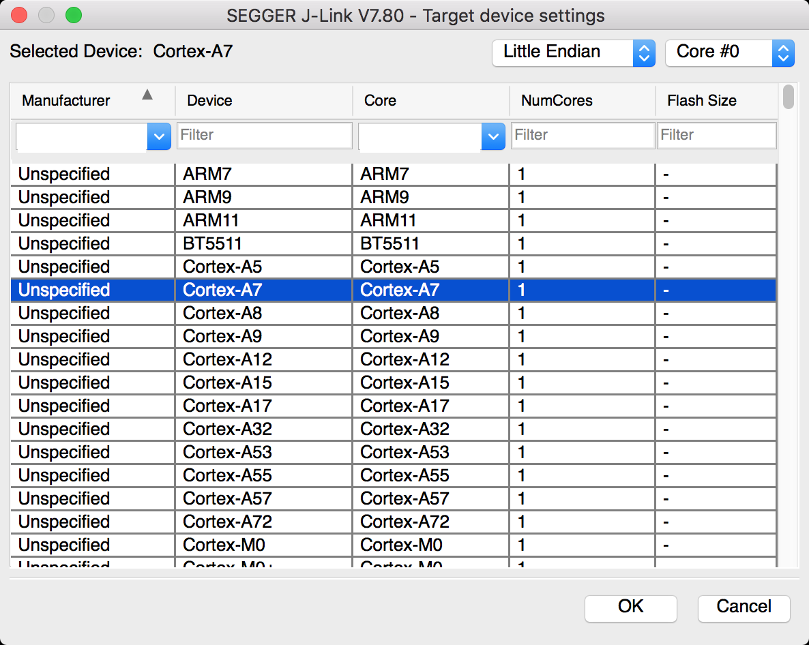
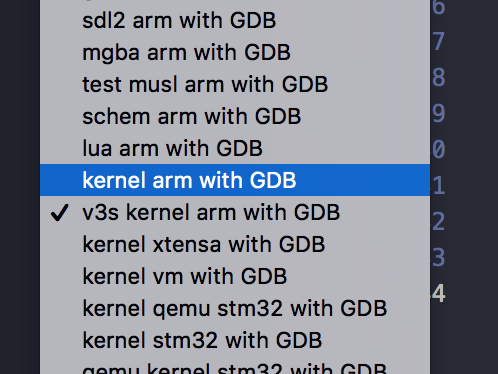

# 硬件调试

正常情况下，在qemu上开发好后，在真实硬件下运行，然而现实免不了出错，这时候就需要用到硬件调试，来定位问题和错误。针对不同的开发板子，涉及到的调试是不太一样的，以下是YiYiYa中涉及的硬件调试，可以参考。

## V3S 开发版本调试

1、uboot 编译成无mmc模式

修改uboot的v3s版本的配置文件`LicheePi_Zero_480x272LCD_defconfig`

>CONFIG_SPL_MMC_SUPPORT=n
>CONFIG_MMC=n

2、uboot编译

```sh
cd uboot
export CROSS_COMPILE=arm-none-eabi-
export ARCH=armv7a
gmake LicheePi_Zero_480x272LCD_defconfig
gmake -j8
```

如果mac下编译，出现python3版本报错，运行以下的命令后再编译。

```sh
export HOSTLDFLAGS="-lpython3.8 -dynamclib"
export LDFLAGS=`python3.4-config --cflags --ldflags`
```

3、硬件Jlink连接

JLink的1，2两引脚，1脚为3.3v，2脚为GND。

|SD卡引脚|JTAG引脚|SD卡信号|
|-----|------|-----|
|8    |GND   |GND  |
|1    |TCK   |D2   |
|8    |TMS   |D1   |
|7    |TDI   |D0   |
|3    |TDO   |CMD  |
|4    |VT    |VCC  |

启动jlinkgdbserver,配置成cortex-a7 就可以直接连了。



4、启动运行

在vscode中选择，点击调试运行。




可以直接通过命令运行
```sh
scons --run=v3s
```